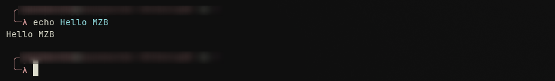
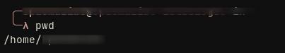
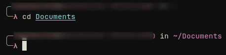
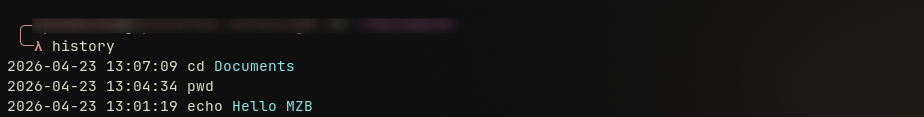
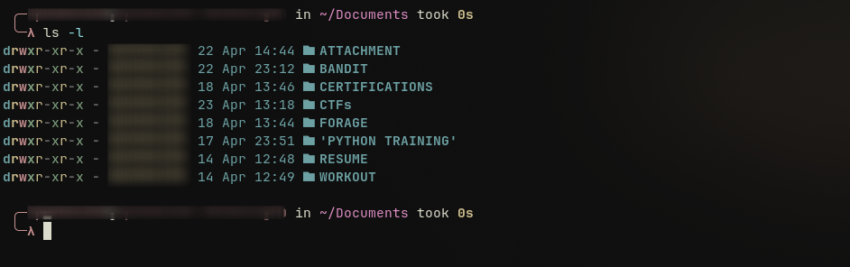
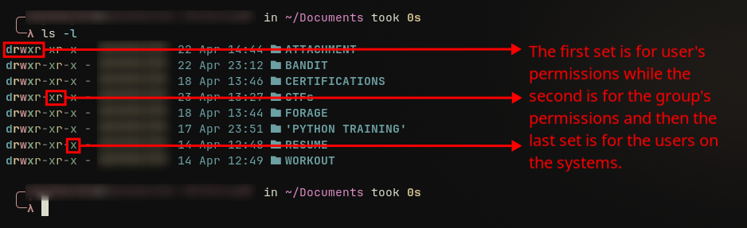
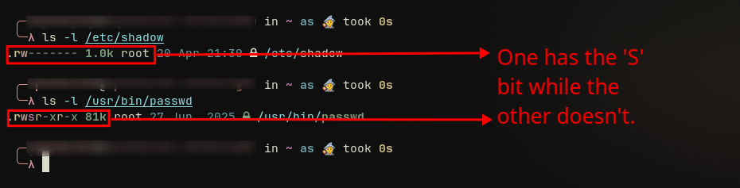
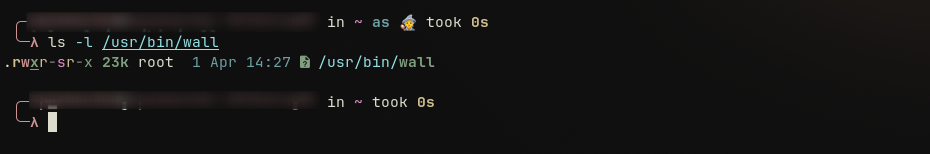
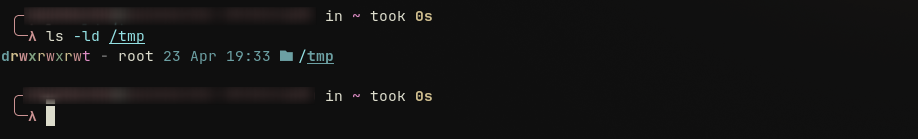

# LINUX CLI

CLI (Command Line Interface)

- First let define the shell: is a program that accepts typed command to pass it to the OS (Operating System) to be executed.
GUI (Graphic User Interface)
This is the graphic interface found in most our modern machines.
- Terminal & console are applications that allows you to access the CLI of your computer.

BASH (Bourne Again Shell) : it's a program that you use to give instructions to the computer.
we also ave cshell, zshell...

SHELL PROMPT 

is the place that you have when you open your terminal to write your commands.

simple command in the terminal:

SOME POPULAR AND SIMPLE COMMANDS

- pwd: This command helps you find the directory you are currently in
  

- cd (Change Directory): this command allows you to move between directories. When used with two dots (. .) it allows you to go back to the previous directory.
  

- ls (List): this command allows you to list all the elements found in the current directory in which you are in.
- touch : the primary purpose of this command is to create a new file. You can use it by typing touch and the name of the file you want to create. Example: `touch MZB90`
- cat : this command allows you to view the contain of a specific file. It can be used as follow: `cat MZB90`
- history: this command allows you to view the history of your previously used command in the terminal.
  

- clear: as its name suggests this command allows you to clear you terminal while working on it for better visibility.

These are some of the most common used Linux command

# PERMISSIONS

FILE PERMISSIONS

First we have to know that in Linux everything is a file and a folder or directory is just a file that contain other files.
To be able to see the permissions of files while in the CLI we are going to use the `ls` command with the option `l` to display their permissions`ls -l` then it will display some specific strings each with its meaning of the permissions that file has next to the.

As we can see on the screenshot above we have strings like `d, r, w, x, -` and each of them has a specific permission.
- r: read permission
- w: write permission
- x: execute permission
- " - ": no permission granted

USER, GROUP PERMISSION

- The first set of permissions is dedicated to the user
- Then the second set of permission is dedicated to the group
- And finally the last set of permissions is for all users on the system.
  

MODIFYING PERMISSIONS

When we need to modify permissions we use the `chmod` (Change mode) command, it has two main methods : symbolic and numerical mode.
- Symbolic: use letters to represent users and permissions. 
	- u: user/owner
	- g: group
	- o: others
	- a: all (user, group, others)
	Example: `chmod u+x myfile` or `chmod g-w myfile`
	- + : add permission 
	- - : remove permission
- Numerical: use numerical or octal mode to change permissions. Allows yo to set all permissions for the user, group, and others at the same time.
	- 4: read (r)
	- 2: write (w)
	- 1: execute (x)
	Example: `chmod 755 myfile`
	- **7 (User):** `4 + 2 + 1` -> The user gets read, write, and execute permissions (`rwx`).
	- **5 (Group):** `4 + 0 + 1` -> The group gets read and execute permissions (`r-x`).
	- **5 (Others):** `4 + 0 + 1` -> All other users get read and execute permissions (`r-x`).
Warning: Recursively setting `777` permissions (`chmod -R 777 /some/directory`) is a common but dangerous practice that gives everyone full read, write, and execute access. Always apply the principle of least privilege, granting only the permissions that are strictly necessary.

OWNERSHIP PERMISSIONS

In a Linux system, every file and directory is assigned an owner and a group. You can modify both the user and group ownership of a file using specific **Linux commands**.

CHANGING USER OWNERSHIP

To transfer the ownership of a file to a different user, you use the `chown` (change owner) command. This is useful when a user's responsibilities change or when you need to assign file control to someone else. To be able to accomplish this you need to be a superuser or admin with the command `sudo`.
Example: `sudo chown patty myfile`
- changes the user owner of `myfile` to the user `patty`. 

CHANGE GROUP OWNERSHIP

Similar to change user ownership bu here we use the command `chgrp` (Change group). This allows all members of the new group to have access based on the group's **Linux permissions**.  Like change user ownership you will also need to be a superuser with the `sudo` command to be able to perform this
Example: `sudo chgrp whales myfile`. 
- sets the group ownership of `myfile` to the group `whales`.

CHANGING BOTH USER AND GROUP

The `chown` command allows you to change both the user and group ownership in a single step. By separating the user and group name with a colon, you can update both attributes simultaneously. 
`sudo chown patty:whales myfile`
This single command assigns user ownership to `patty` and group ownership to `whales` for the file `myfile`. This is the most common method for managing **Linux file ownership**.

## UMASK

Every file that gets created comes with a default set of permissions. if you want to change default permissions you use the `umask` command it uses 3 bits permission set we see in numerial permissions.
Example: `umask 021`
In our example, we are stating that we want the default permissions of new files to allow users access to everything, but for groups, we want to take away their write permission, and for others, we want to take away their executable permission. The default `umask` on most distributions is `022`, meaning full user access, but no write access for group and other users.

## SETUID
There are many cases in which normal users need elevated access to do stuff. The system administrator can't always be there to enter a root password every time a user needs access to a protected file, so there are special file permission bits to allow this behavior. The Set User ID (SUID) allows a user to run a program as the owner of the program file rather than as themselves.

When a file has the bit `s` in its permissions that means that it allows the users who run the program to get the root access or file owner's permission as well as execution permission, in this case root. So basically when a user is running the command `passwd` he is running as root.

so whoever runs the `passwd` command is using it as root because of the `s` bit permission.

MODIFYING SUID 

We have two ways:
- symbolic way:
	Example : `sudo chmod u+s myfile`
- Numerical way: 
	Example : `sudo chmod 4755 myfile` 
	The number `4755` is interpreted as four separate digits:

	-  **4**: Sets the **setuid (Set User ID)** bit. 
    
	- **7**: Grants the **owner** read (4), write (2), and execute (1) permissions (4+2+1=7 → rwx). 
    
	- **5**: Grants the **group** read (4) and execute (1) permissions (4+1=5 → r-x). 
    
	- **5**: Grants **others** (everyone else) read and execute permissions (→ r-x).

## SETGID
Similar to the set user ID permission bit, there is a set group ID (SGID) permission bit. This bit allows a program to run as if it were a member of that group.
Example: when we use this command `ls -l /usr/bin/wall` 

Here we can see that the permission bit is in the group permission set.

MODIFYING SGID

Here again we have the symbolic way and numerical way.
Example: `sudo chmod g+s myfile` & `sudo chmod 2555 myfile` 
The numerical representation for SGID is 2.

STICKY BIT

The sticky bit is a permission setting that can be applied to a directory. When a directory has the sticky bit set, files within that directory can only be deleted or renamed by the file's owner, the directory's owner, or the root user. This is particularly useful for shared directories where multiple users need to create and manage their own files without interfering with others. This concept is a key part of **Unix file permissions sticky bit** management.
Here is an example:

The `t` indicates that the sticky bit is set.

HOW TO SET THE STICKY BIT

We can use the `chmod` command
Example: `chmod +t my_shared_dir`

PROCESS PERMISSIONS

Let's segue into process permissions for a bit. Remember how I told you that when you run the `passwd` command with the SUID permission bit enabled, you will run the program as root? That is true. However, does that mean since you are temporarily root, you can modify other users' passwords? Nope, fortunately not!

This is because of the many UIDs that Linux implements. There are three UIDs associated with every process:

When you launch a process, it runs with the same permissions as the user or group that ran it. This is known as an **effective user ID**. This UID is used to grant access rights to a process. So, naturally, if Bob ran the `touch` command, the process would run as him, and any files he created would be under his ownership.

There is another UID, called the **real user ID**. This is the ID of the user that launched the process. These are used to track down who the user who launched the process is.

One last UID is the **saved user ID**. This allows a process to switch between the effective UID and real UID, and vice versa. This is useful because we don't want our process to run with elevated privileges all the time; it's just good practice to use special privileges at specific times.

Now let's piece these all together by looking at the `passwd` command once more.

When running the `passwd` command, your effective UID is your user ID; let's say it's 500 for now. Oh, but wait, remember the `passwd` command has the SUID permission enabled. So when you run it, your effective UID is now 0 (0 is the UID of root). Now this program can access files as root.

Let's say you get a little taste of power, and you want to modify Sally's password. Sally has a UID of 600. Well, you'll be out of luck. Fortunately, the process also has your real UID, in this case 500. It knows that your UID is 500, and therefore you can't modify the password of UID 600. (This, of course, is always bypassed if you are a superuser on a machine and can control and change everything).

Since you ran `passwd`, it will start the process off using your real UID, and it will save the UID of the owner of the file (effective UID), so you can switch between the two. No need to modify all files with root access if it's not required.

Most of the time, the real UID and the effective UID are the same, but in such cases as the `passwd` command, they will change.
