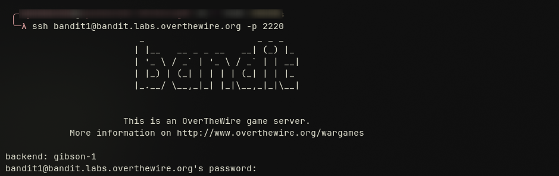

First let start wit defining what is "overthewire bandit" and what is its purpose.
Overthewire bandit  is a free wargame for designed to teach Linux command line skills and cyber security concepts through interactive challenges. It help beginner to learn and get familiar with Linux command on the CLI or command line terminal. It consist of multiple levels through which the user have to first connect to the overthewire server and then look for specific keys hidden in the server, each of those keys allow him to pass to the next level otherwise he won't be able to go to the next level.

# LEVEL0: 

For this first level the challenge was to just explain to you what is the game all about and how to connect to the overthewire server using `ssh` , the name of the host `bandit.labs.overthewire.org`, the port which is port `2220` , the username `bandit0`, and the password which is `bandit0`.
So after opening your terminal on your computer the command you type is:
```
ssh bandit0@bandit.labs.overthewire.org -p 2220
```

and then the password `bandit0`. 
![[swappy-20260422-233932.png]]
After being connected now we search for the key that will allows us to connect to level1. The password was located in a file in the home directory, the file was called 'readme' and to be able to read its content i used the `cat` command and found the password.
![[swappy-20260422-233947.png]]

# LEVEL1
Now for the first level i was asked to find the password stored in a files called " - " located into the home directory.
To be able to get the password for this level i had to find a way to open a file of this (-) type. For this i used the `nano` command and the name of the file `nano ./-`
![[swappy-20260422-234013.png]]
and here was the password inside the file
![[swappy-20260422-234001.png]]

# LEVEL2
On level2 of our wargame the challenge was to find the password stored in a file called "--spaces in this filename--" that was located into the home directory. This challenge was an opportunity for me to learn how to open files with such names names that start with -- and end with -- . To be able to solve this i used the `cat` command and  " " and the name of the file `cat "--spaces in this filename--"` 
![[swappy-20260422-234023.png]]
