## PROCESSES
Process is usually represented by `ps`
Processes are programs that are currently running. Each process is assigned a unique ID when it's created Process ID (PID). 
To see your running processes use the `ps` command. 

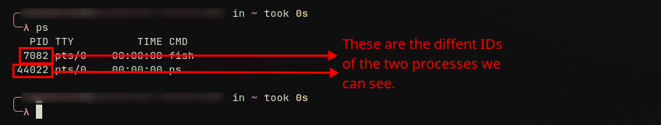

On our screenshot above we can see the different process IDs of our two processes. 
This output also shows a few key details:
- **PID**: The unique Process ID.
- **TTY**: The controlling terminal for the process.
- **STAT**: The current status of the process.
- **TIME**: The total CPU time the process has used.
- **CMD**: The command that started the process.

EXPLORING `PS` WITH BSD-STYLE OPTIONS

BSD-style: popular combination is `ps aux` 

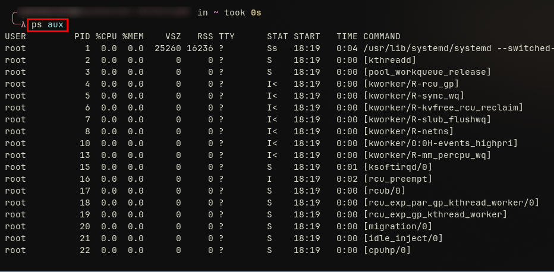

this list all the current processes running on our device
the `aux` means:
- a : displays all processes for all users
- u : provides a detailed, user oriented format
- x : Includes processes not attached to any terminal. These often include system daemons that start at boot and show a `?` in the TTY column.
  
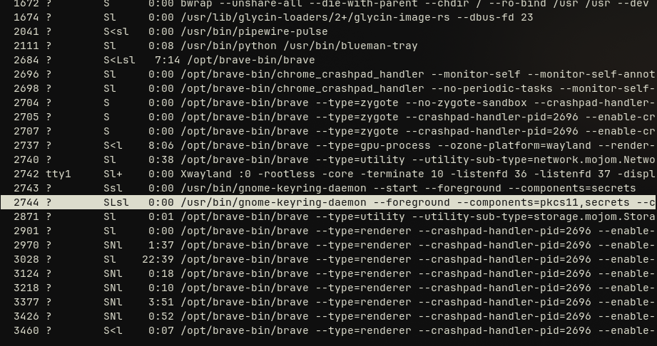

as we can see the highlighted process is a daemon.

Each for these can also be used separately together with the `ps` command. Example: `ps a`, `ps au`, `ps ax`, `ps x`, `ps u.

SYSTEM V STYLE

You will frequently see the `ps -ef` command** used by system administrators.
Example : `ps -ef`
The `ps -ef` Linux command provides a full listing of all processes.
- **-e**: Selects every process on the system.
- **-f**: Displays a "full-format" listing, which includes details like UID, PPID (Parent Process ID), C (CPU utilization), and STIME (start time).

TOP 

is a command that allows you to monitor processes in real time

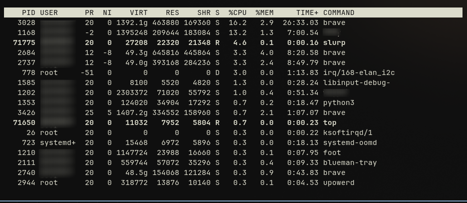

## CONTROLLING TERMINAL
When you inspect running processes, you'll notice a `TTY` field in the `ps` command's output. This field is important as it indicates the **controlling terminal** that executed the command. Understanding this concept is key to managing processes effectively.

### TTY (Teletype)
It's a terminal that provides the standard input and output for a process. I basically consoles the processes processes that running in the terminal.
We have two main terminals terminal devices && pseudo-terminal devices.
- terminal devices: is a native console that allows you to type commands and see output directly.
- pseudo-terminal device : is what you most commonly use. When you open a terminal application within your graphical desktop environment, you are using a PTS. These emulate a terminal within a window.

ROLE OF THE CONTROLLING TERMINAL

Most processes are bound to a **controlling terminal**. This means the process's life cycle is tied to the terminal session that started it. For example, if you run a program like `find` in your terminal window and then close that window, the `find` process will also be terminated.

PROCESSES WITHOUT CONTROLLING TERMINAL

Some processes, known as daemons, are designed to run in the background and manage system services. These processes often start when the system boots and stop only when it shuts down. The TTY doesn't control those processes running in the background so when you will want to see the information about processes for TTY if it's a daemon it will show this " ? "

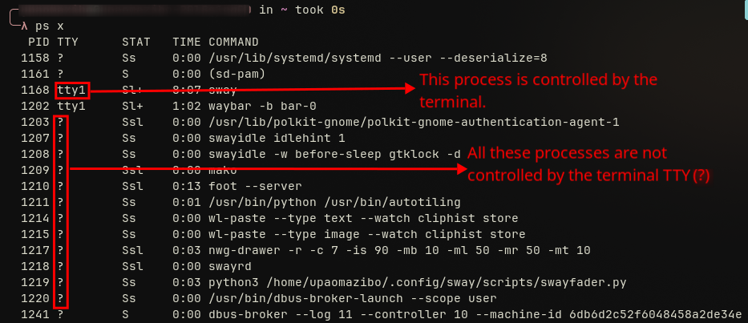

To prevent them from being accidentally terminated, daemons are not attached to a **controlling terminal**.

## PROCESS DETAILS
A process is a program in execution. 
Example : when you run the `cat` command on your terminal. 

## PROCESS CREATION

FORK && EXEC MODEL

The primary mechanism for **process creation in Linux** involves an existing process cloning itself using the `fork` system call. The `fork` call creates a nearly identical child process. This new child process receives its own unique Process ID (PID), while the original process becomes its parent, identified by a Parent Process ID (**PPID**).
After forking, the child process can either continue running the same program as its parent or, more commonly, use the `execve` system call to load and run a new program. The `execve` call effectively replaces the process's memory space with that of the new program, allowing a different task to begin. This two-step "fork-exec" model is a cornerstone of how you **create a process in Linux**.

OBSERVING PARENT-CHILD RELATIONSHIP

to be able to see the different relations between your processes you can use `ps l`

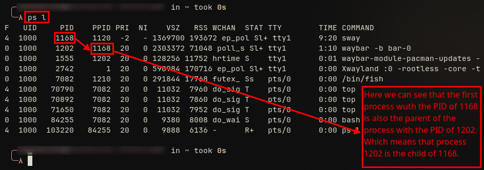

INIT PROCESS

If every process is a child of another, there must be an original ancestor. This is the `init` process. When the system boots, the kernel creates `init` as the very first user-space process, assigning it a PID of 1. The `init` process is the ultimate parent of all other processes and runs with root privileges to manage the system. It cannot be terminated until the system shuts down and is responsible for spawning many of the services that keep the system running.

## PROCESS TERMINATION
TERMINATION PROCESS

A process typically terminates by calling the `_exit` system call.
However, calling `_exit` doesn't immediately erase the process. The parent process must acknowledge its child's termination by using the `wait` system call.
Another way to `linux kill child process` is by using signals, a topic we will explore in a later lesson.

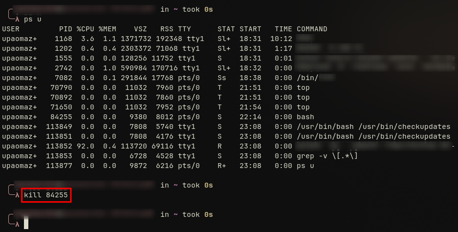

ORPHAN PROCESSES

Process which the parent process was terminated or terminate before the child process, that process is called orphan.

ZOMBIE PROCESSES

When a child process terminate when the parent hasn't yet called `wait` this is when we call he child process a ZOMBIE process.
Zombie processes are already dead, so they don't consume CPU time.

## SIGNALS
It's a software interrupt sent to a process to notify it that an important event has occurred.
The purpose of a signal is to serve as a primary method of inter-process communication (IPC). They have many uses:
- **User Interaction**: A user can type special terminal characters, like `Ctrl-C` (SIGINT) or `Ctrl-Z` (SIGTSTP), to interrupt or suspend foreground processes.
- **Kernel Notifications**: The kernel can send signals to a process to notify it of hardware or software issues, such as an illegal memory access (SIGSEGV).
- **Process Management**: System administrators and other processes use signals to manage the lifecycle of other processes, such as requesting termination or a configuration reload.

## KILL (TERMINATE)
Primary command used to send signals to manage processes, it send various signal not just terminate process.

DEFAULT TERMINATION WITH KILL SIGTERM (-15)
When you use the `kill` command with the PID it usually kills the process.

The `kill sigterm` signal (also known as `SIGTERM` or signal 15) requests that the process shut down cleanly. This gives the process a chance to save its progress and release resources properly. You can also explicitly use the signal number, making `kill -15 12445` equivalent to the command above. This addresses the common `kill -15 linux` query.

FORCING TERMINATION WITH SIGKILL(-9)
Sometimes a process becomes unresponsive and won't react to a `SIGTERM` signal. In these cases, you can force it to stop using the `KILL` signal.
Example: `kill -9 84255`
The `SIGKILL` signal (signal 9) terminates the process immediately, without giving it a chance to clean up. This is a key difference in the `kill vs terminate` debate; `SIGKILL` is an unconditional termination, while `SIGTERM` is a polite request.

CHECKING PROCESS EXISTENCE WITH KILL -0

A special use case is `linux kill -0`. This command doesn't actually send a signal but instead checks if a process with the specified PID exists and if you have permission to signal it.
Example: `kill -0 84255`
If the command executes successfully (exit code 0), the process exists. If it fails, the process does not exist or you lack permissions.

## NICENESS
When you run multiple applications on your computer, it seems like they are all running simultaneously. In reality, the CPU is rapidly switching between them, giving each process a small amount of processing time.

HOW CPU MANAGES PROCESSES

Each process is allocated a small amount of CPU time called a "time slice". After its time slice, a process is paused, and the CPU moves to the next one. By default, the Linux kernel schedules processes in a round-robin fashion, ensuring every process gets a fair share of CPU time until it completes. The kernel's scheduler is highly efficient at managing these rapid switches.

NICENESS IN LINUX

While processes cannot directly control their CPU time, you can influence the kernel's scheduling decisions. This is done by adjusting the **linux niceness** value of a process. The term "niceness" refers to how "nice" a process is to other processes on the system.
The **niceness of a process** is represented by a number ranging from -20 (highest priority) to 19 (lowest priority).
- A high niceness value (e.g., 19) means the process is very "nice" and has a low priority, yielding CPU time to others.
- A low or negative niceness value (e.g., -20) means the process is not "nice" and demands more CPU time, giving it a higher priority.

## PROCESS STATES
A process is either running, waiting, or terminated.

## /PROC FILESYSTEM 
In Linux, a core principle is that everything is treated as a file.This concept extends to running processes, whose information is dynamically stored in a special virtual filesystem known as `/proc`. The `/proc` filesystem is not a real filesystem on your hard drive; it's created in memory by the kernel. It provides a window into the kernel's internal data structures and the state of the system.
To be able to access it we use the `ls /proc` command.

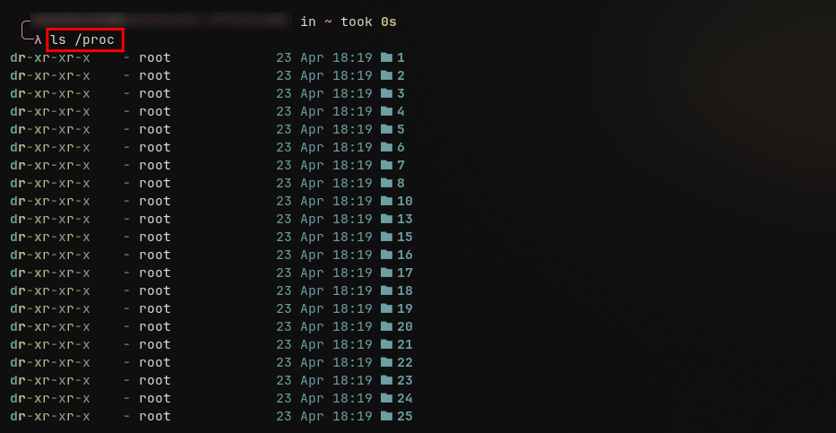

You will see many numbered directories. Each number corresponds to the Process ID (PID) of a currently running process. You'll also find other files like `cpuinfo` and `meminfo` that provide system hardware information.

ACCESS SPECIFIC PROCESS INFORMATION

Here you can use the `cat` command 
Example: `cat /proc/12345/status`

And this was the output showing information about the process we specified using its PID

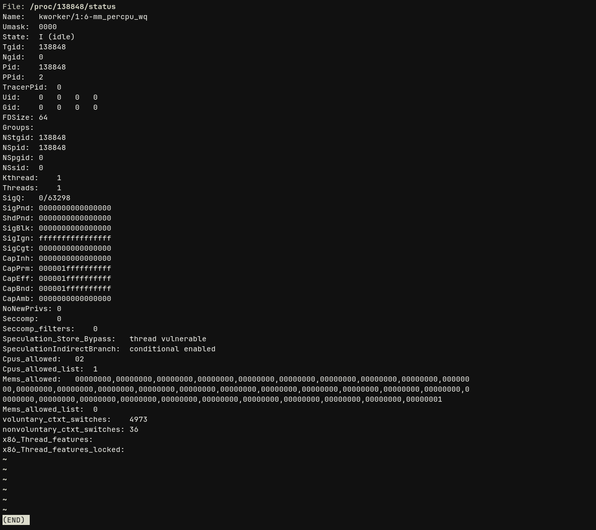

## JOB CONTROL
In Linux, you often encounter commands that take a long time to complete. Instead of waiting and leaving your terminal unusable, you can use **Linux job control** to manage these tasks.

RUNNING A COMMAND IN A BACKGROUND

Here the `sleep` command followed by the PID and `&`
Example: `sleep 1000 &`

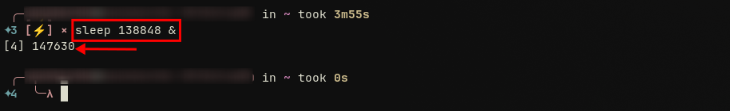

LISTING BACKGROUND JOBS

Here we use the `jobs` command

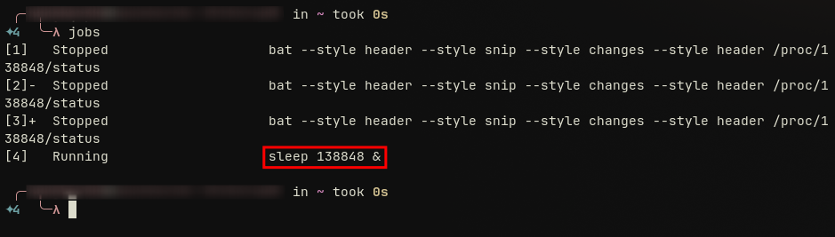

As we can see in this output after running our `jobs` command to view the jibs running in the background and we can see the process we have put to run in the background in our previous screenshot.

MANAGING ACTIVE PROCESSES

What if a command is already running in the foreground and you decide you need your terminal back? You don't need to stop it. First, suspend the running process by pressing `Ctrl-Z`. Then, use the `bg` command to send that suspended job to the background.

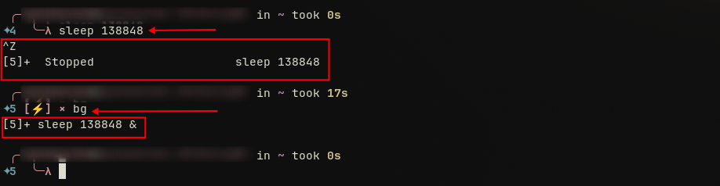

Now, the `sleep 1003` process is running as a background job, and you can verify this with the `jobs` command.

BRINGING A JOB IN THE FOREGROUND

Here we use the `fg` command and you specify the jib ID
Example: `fg %138848` 

TERMINATE BACKGROUND JOBS
Here we are also going to use the `kill` command
Example: `kill %138848`

