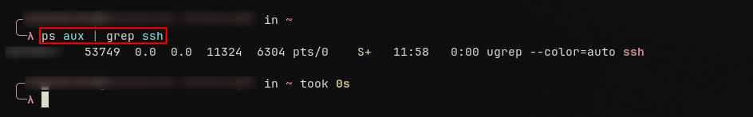

## PIPELINES ( | )

They connect the output of one command directly into the output of another forming a chain of processing steps. It's basically chaining multiple command together using `|`
Here is the syntax : `command1 | command2 | command3 ...`
Example: `ps aux | grep ssh`

Here we understand that the first command listed the different processes that were running then the second grepped the one with `ssh` 
Pipelines are used in cyber security for log analysis, network inspections, threat hunting and also automation.

SECURITY CONSIDERATION

The problem of pipelines is that they can hide failure if the previous command fails. 
Also Unsanitized input inside pipelines can lead to command injection and overly complex pipelines reduces auditability keep them readable

## SHELL REDIRECTION

It controls where input comes from and where output goes by manipulating standard streams:
- `stdin`(0)
- `stdout`(1)
- `stderr`(2)
Syntax: 
- Output: `command > file.txt`
- Input: `command < input.file`
- Error redirection: `command 2> error.log`
- Redirection of both `stdout`  & `stderr`: `command > output.log 2>&1` 

Meanings:
- `>`: replace file contents
- `>>`: preserves existing data
- `2>`: isolates errors for debugging or logging
Redirection normally happens before privilege escalation

Example: Append Logs

 
Shell redirection can be used in cyber security for secure logging, forensics, noise reductions and more.

SECURITY CONSIDERATIONS

it Prevents accidental overwrite

It avoid privilege mistakes 

And also protect sensitive output and prevent data leaks

## MAIN DIFFERENCE BETWEEN PIPELINES AND SHELL REDIRECTION

- **Pipelines (`|`)** : move data _between commands_
- **Redirection (`>`, `<`, 2>)** : move data between commands and files
